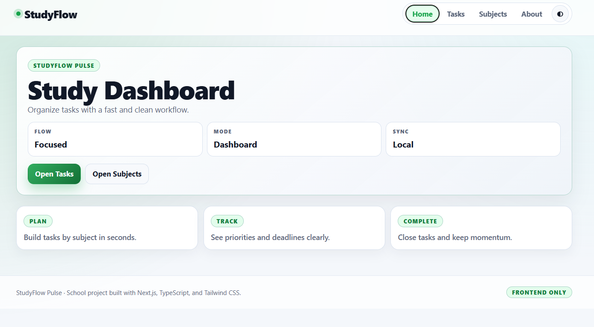
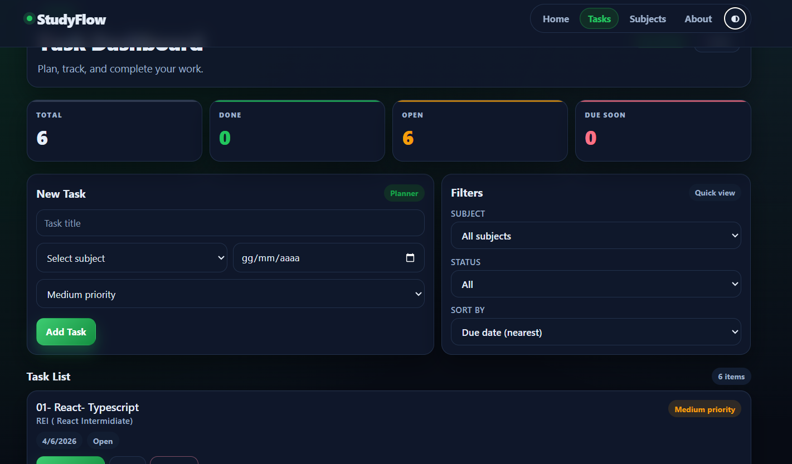
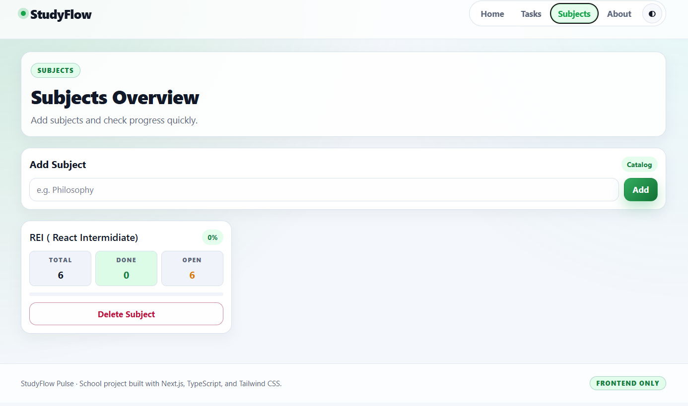
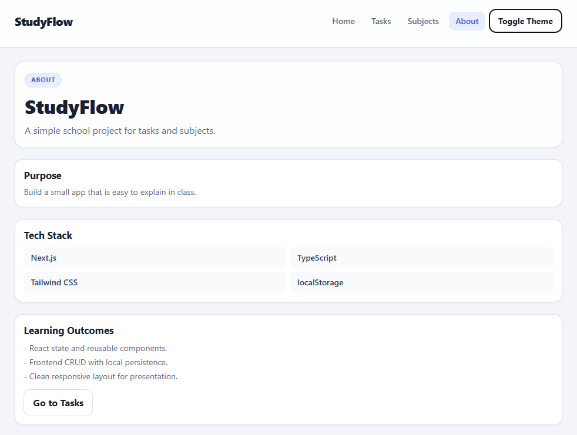

# StudyFlow

StudyFlow is a frontend-only study planner built with **Next.js App Router**, **TypeScript**, and **Tailwind CSS**. It helps students organize tasks, subjects, and progress in a clean dashboard-style interface.

The latest UI style, **StudyFlow Pulse**, introduces a compact, modern visual system with strong metrics, green accent highlights, and polished light/dark themes.

## Screenshots






## Features

- Create, edit, complete, and delete tasks
- Add custom study subjects
- Select a subject when creating or editing tasks
- Delete subjects only when they have no related tasks
- Filter tasks by subject and status
- Sort tasks by due date, priority, or newest
- View task statistics
- View progress by subject
- Toggle between Light and Dark theme
- Persist tasks, subjects, and theme in localStorage
- Seed demo data only on the first app load

## Tech Stack

- Next.js App Router
- React
- TypeScript
- Tailwind CSS
- Browser localStorage

## Pages Overview

- `/` (Home): Dashboard-style overview and quick navigation
- `/tasks`: Main task workspace (form, filters, stats, list)
- `/subjects`: Subject management and subject progress cards
- `/about`: Project summary, stack, and learning outcomes

## Data Persistence

StudyFlow is **frontend-only** and stores everything in browser localStorage:

- Tasks: `studyflow.tasks`
- Subjects: `studyflow.subjects`
- Theme: `studyflow.theme`

Technical notes:

- `task.subject` remains a **string** for simplicity.
- Subject options are merged from saved subjects and existing task subjects so demo/legacy tasks still work.
- Demo tasks are seeded only on the first app load, not every time the task list is empty.

## Subject Management

- Users can add custom subjects from the Subjects page.
- A subject can be deleted only if it has zero related tasks.
- Subjects with existing tasks cannot be deleted to avoid orphan task data.
- If a subject is still used by tasks, the app shows a blocking message.

## Theme System

- Light and Dark themes are supported.
- Theme preference is stored in localStorage under `studyflow.theme`.
- The selected theme is applied on reload.

## How to Run Locally

```bash
npm install
npm run dev
npm run lint
npm run build
```

Then open `http://localhost:3000`.

## Project Structure

```text
studyflow/
├─ public/
│  └─ screenshots/
├─ src/
│  ├─ app/
│  │  ├─ page.tsx
│  │  ├─ tasks/page.tsx
│  │  ├─ subjects/page.tsx
│  │  ├─ about/page.tsx
│  │  ├─ layout.tsx
│  │  └─ globals.css
│  ├─ components/
│  │  ├─ TaskForm.tsx
│  │  ├─ TaskFilters.tsx
│  │  ├─ TaskStats.tsx
│  │  ├─ TaskList.tsx
│  │  ├─ TaskCard.tsx
│  │  └─ layout/
│  │     ├─ SiteNav.tsx
│  │     └─ SiteFooter.tsx
│  ├─ lib/
│  │  └─ storage.ts
│  └─ types/
│     └─ task.ts
└─ README.md
```

## What I Learned

- Building a complete frontend CRUD flow with React state
- Structuring a Next.js App Router project with reusable components
- Managing local persistence safely with localStorage
- Designing a compact dashboard UI for presentation
- Keeping UX rules clear (for example, protected subject deletion)

## Future Improvements

- Add optional task notes
- Add due-date reminders (frontend notifications)
- Add data export/import (JSON)
- Add optional subject color tags
- Add basic automated tests for storage and UI flows
